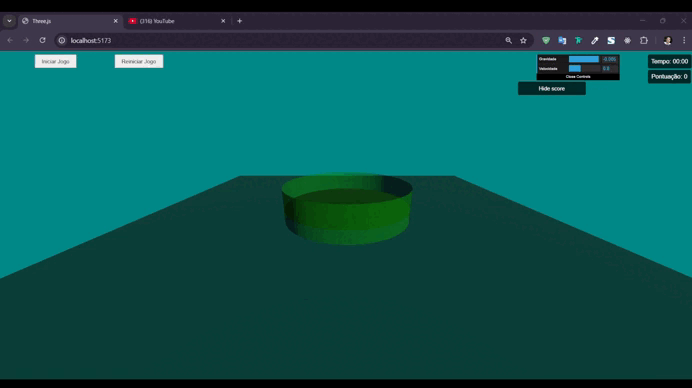

<h1 align="center">Game	Cesta	de	Bolinhas</h1>

O projeto é uma simulação física interativa baseada em um sistema de partículas que permite a interação do usuário. Esse jogo consiste em uma "cesta" ou "bacia" que pode ser controlada pelo usuário com o uso do mouse. As bolinhas, geradas como partículas no topo da tela, caem seguindo as leis da física. O desafio do jogador é capturá-las antes que atinjam o solo. A simulação incorpora conceitos de física, como gravidade e colisões, garantindo um comportamento realista tanto na queda das bolinhas quanto na interação com a cesta e o ambiente. 🚀

<h2 align="center">Vídeo do Projeto</h2>

	

Link do vídeo mostrando o projeto em funcionamento: <a href="https://youtu.be/f5671DC7bBY?si=4WRgQBiclyQdGl7T" target="_blank"> Clique aqui!</a>

## Aquisição de texturas

As texturas utilizadas no projeto podem ser encontradas no site abaixo.  
<a href="https://freepbr.com/" target="_blank"> Clique aqui!</a>

## Tecnologias e Ferramentas Utilizadas 🔧

  
  
  
  
  
  
  
  
  
   
Para criar um ambiente adequado de desenvolvimento Web, executamos os seguintes passos:

### Instalação do Node
Instale o NodeJs para usar as dependências corretamente. Acesse o site https://nodejs.org/

### Editor de código

Escolha um editor de código de sua preferência. Algumas opções populares incluem o Visual Studio Code, Sublime Text, Atom, entre outros. Você pode baixar e instalar o Visual Studio Code em https://code.visualstudio.com/.

Para preparar um ambiente adequado a fim de instalar suas dependÊncias, execute o seguinte comando na sua pasta do projeto:

~~~
	npm init -y
~~~

Esse comando inicializa o projeto, adicionando o arquivo package.json, muito importante para registrar as dependências instaladas.

### Instalação do vite

O Vite vai ser utilizado para executar seu projeto. Instale o vite por meio do comando:
~~~
npm install vite
~~~

### Usar a biblioteca Three.JS
Você pode incluir o Three.js diretamente em seu projeto HTML fazendo a instalação da biblioteca do Three.Js usando o seguinte comando na pasta do seu projeto:

~~~
	npm install three
~~~
## Executando o Projeto ⏳

Para executar o projeto, realize as seguintes etapas:

### Clone do repositório

- Verifique se o git está instalado na sua máquina
- Digite o comando via terminal

~~~
git clone https://github.com/prsousa8/basket-balls_computer-graphics.git
~~~

E entre na pasta do projeto usando 

~~~
cd basket-balls_computer-graphics
~~~

### Instalação de dependências

Instale todas as dependências de uma única vez com:
~~~
npm install
~~~

### Execução

Utilize o comando abaixo via terminal para executar o código:
~~~
npx vite
~~~

## Colaboradores

<table align="center">
<tr>
  <td align="center"><a href="https://github.com/caua-braga-de-lima"> <b>Cauã Braga</b></a> </td>
  <td align="center"><a href="https://github.com/Geovanarsouza"> <b>Geovana Rodrigues</b></a> </td>
  <td align="center"><a href="https://github.com/prsousa8"> <b>Paulo Ricardo</b></a> </td>
  <td align="center"><a href="https://github.com/Raquel-Luis-Duarte"> <b>Raquel Duarte</b></a> </td>
  <td align="center"><a href="https://github.com/Samuel-C-C"> <b>Samuel Camilo</b></a> </td>
  <td align="center"><a href="https://github.com/YasminEmily"> <b>Yasmin Emily</b></a> </td>
</tr>
</table>
